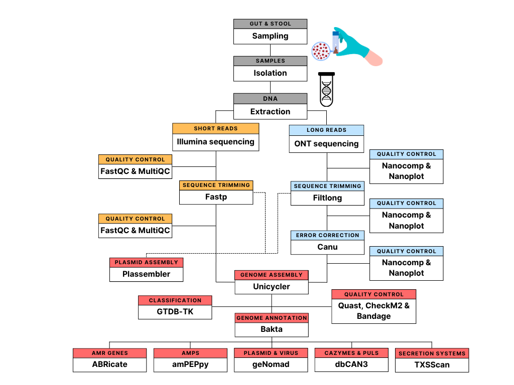

<!-- Created by Hendrik Bethge, 06.05.2026 -->

# Hybrid Genome Assembly Pipeline

## Table of Contents
- [Hybrid Genome Assembly Pipeline](#hybrid-genome-assembly-pipeline)
  - [Table of Contents](#table-of-contents)
  - [1. Overview](#1-overview)
  - [2. Hybrid Assembly Workflow](#2-hybrid-assembly-workflow)
    - [2.1 Installation](#21-installation)
    - [2.2 Running the Assembly Pipeline](#22-running-the-assembly-pipeline)
  - [3. Downstream Genomic Analysis](#3-downstream-genomic-analysis)
  - [4. Citation](#4-citation)


---

## 1. Overview

This repository contains a complete workflow for generating **bacterial hybrid genome assemblies** from Illumina short reads and Oxford Nanopore Technologies (ONT) long reads, followed by several downstream genomic analyses.

### Workflow Diagramm


--- 

The repository consists of two main components:

### Hybrid Genome Assembly Pipeline

- Short-read quality control and trimming
- Long-read quality control, filtering and correction
- Hybrid genome assembly
- Assembly quality assessment
- Genome annotation
- Taxonomic classification
- Plasmid assembly

The assembly workflow is intended to be executed as a complete pipeline using `assembly_pipeline.sh`. Individual tools are not intended to be run independently within this repository workflow. Help for each individual tool can be found in their official documentation. 

Installation of all required software and databases is handled separately through `installation_pipeline.sh`.

---

### Downstream Genomic Analysis Pipeline

- Antimicrobial peptide (AMP) detection
- CAZyme, CGC and PUL-based substrate prediction
- Plasmid similarity analysis
- IMG/PR plasmid identification
- Bacterial secretion system detection


Documentation for installation and execution of each downstream analysis tool is available in the corresponding subdirectories.

---

## 2. Hybrid Assembly Workflow

The assembly pipeline performs the following steps:

1. Illumina read quality control and trimming
2. ONT read quality control, filtering and correction
3. Hybrid genome assembly
4. Assembly quality assessment
5. Genome annotation
6. Taxonomic classification
7. Plasmid assembly

The following software packages are used throughout the workflow:

| Category | Tool | Repository |
|-----------|-----------|-----------|
| Short-read QC | FastQC | [FastQC](https://github.com/s-andrews/FastQC) |
| QC Aggregation | MultiQC | [MultiQC](https://github.com/MultiQC/MultiQC) |
| Short-read Trimming | Fastp | [Fastp](https://github.com/OpenGene/fastp) |
| Long-read QC | NanoPlot | [NanoPlot](https://github.com/wdecoster/NanoPlot) |
| Long-read QC | NanoComp | [NanoComp](https://github.com/wdecoster/nanocomp) |
| Long-read Filtering | Filtlong | [Filtlong](https://github.com/rrwick/Filtlong) |
| Long-read Error Correction | Canu | [Canu](https://github.com/marbl/canu) |
| Hybrid Assembly | Unicycler | [Unicycler](https://github.com/rrwick/Unicycler) |
| Assembly Evaluation | QUAST | [QUAST](https://github.com/ablab/quast) |
| Genome Quality Assessment | CheckM | [CheckM](https://github.com/Ecogenomics/CheckM) |
| Genome Quality Assessment | CheckM2 | [CheckM2](https://github.com/chklovski/CheckM2) |
| Genome Annotation | Prokka | [Prokka](https://github.com/tseemann/prokka) |
| Genome Annotation | Bakta | [Bakta](https://github.com/oschwengers/bakta) |
| Taxonomic Classification | GTDB-Tk | [GTDB-Tk](https://github.com/Ecogenomics/GTDBTk) |
| Plasmid Assembly | Plassembler | [Plassembler](https://github.com/gbouras13/plassembler) |

---

### 2.1. Installation


All required software environments and databases can be installed using:

```bash
installation_pipeline.sh
```

#### Before Running the Installation Script

Modify the following variables inside: `installation_pipeline.sh`

```bash
home_dir=
db_home_dir=
```

Additional manual modification:

- Update the GTDB-Tk database path as indicated in the script comments.

### Requirements

The installation process involves downloading and preparing multiple large databases.

Recommended resources:

| Resource | Recommendation |
|-----------|-----------|
| CPU cores | ≥ 28 |
| Memory | ≥ 128 GB RAM |
| Runtime | Up to 48 h |

### Dependencies

Before running the installation script:

1. Install Micromamba:  
   <https://mamba.readthedocs.io/en/latest/installation/micromamba-installation.html>

Micromamba version **1.4.2** was used during development of this workflow.

---

### 2.2 Running the Assembly Pipeline

After successful installation:

```bash
bash assembly_pipeline.sh
```

### Before Running the Pipeline

Modify the following variables inside:`assembly_pipeline.sh`

```bash
home_dir=
db_home_dir=
```

### Input Data

Place sequencing reads into:

```text
00_raw_reads/
├── raw_short_reads/
│   ├── SampleA_1.fastq.gz
│   ├── SampleA_2.fastq.gz
│   └── ...
│
└── raw_long_reads/
    ├── SampleA.fastq.gz
    └── ...
```

### Resource Requirements

GTDB-Tk may fail during pplacer placement if insufficient memory is available.

Recommended:

```text
≥ 64 GB RAM
```

### Main Outputs

```text
03_assembly/
04_assembly_qc/
05_annotated_genomes/
06_taxonomic_classification/
07_plasmid_assembly/
```

---

## 3. Downstream genomic analysis

After assembly and annotation are complete, several downstream genomic analysis workflows can be applied. Detailed documentation for installation, execution, input requirements, and output interpretation is available in the corresponding subdirectories.


| Module | Description |
|----------|-------------|
| [amp_detection](amp_detection/) | Machine-learning based antimicrobial peptide prediction |
| [CAZyme_detection](CAZyme_detection/) | CAZyme detection, CGC identification and PUL-based substrate prediction using dbCAN3 |
| [plasmid_analysis/imgpr.md](plasmid_analysis/imgpr.md) | Identification of plasmids using the IMG/PR database |
| [plasmid_analysis/genomad.md](plasmid_analysis/genomad.md) | Identification of plasmids using geNomad |
| [plasmid_analysis/mummer.md](plasmid_analysis/mummer.md) | Pairwise plasmid comparison analysis using MUMmer |
| [secretions_system_analysis/TXSScan.md](secretions_system_analysis/TXSScan.md) | Detection of bacterial secretion systems |

---

## 4. Citation

If you use this workflow in a publication, please cite the original publications and software packages corresponding to the tools used in the pipeline.

---
